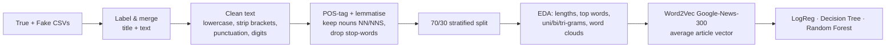

# 📰 Semantic Fake News Detection with Word2Vec


-4B8BBE?style=flat-square)

[](https://colab.research.google.com/github/AnishRane-cox/Semantic-Fake-News-Detector/blob/main/Fake_News_Detection.ipynb)

> Classifying **~45,000 news articles as true or fake** based on their **meaning**, not just keywords — using noun-focused lemmatisation and pre-trained **Word2Vec** embeddings.

| Model | Accuracy | Precision | Recall | **F1** |
|---|---|---|---|---|
| **Logistic Regression** | 0.904 | 0.894 | **0.906** | **0.900** |
| Random Forest | **0.907** | **0.910** | 0.893 | **0.902** |
| Decision Tree | 0.824 | 0.830 | 0.793 | 0.811 |

*Evaluated on a stratified 30% validation split.*

---

## 📌 Problem

Misinformation spreads faster than it can be fact-checked manually. A system that flags likely-fake articles automatically helps media platforms protect credibility and prioritise human review.

Keyword models (Bag-of-Words, TF-IDF) treat words as unrelated tokens. **Semantic** models use embeddings in which similar words sit close together, so the classifier can generalise from *"scandal"* to *"cover-up"* even if one of them was never seen during training.

## 🗂️ Data

| File | Articles | Columns |
|---|---|---|
| `True.csv` | 21,417 | title, text, date |
| `Fake.csv` | 23,502 | title, text, date |

## 🔬 Pipeline



1. **Preparation** – labelled both datasets, merged them and combined `title` + `text` into one field.
2. **Cleaning** – lowercase, remove bracketed text, punctuation and words containing numbers.
3. **Linguistic filtering** – spaCy POS tagging + lemmatisation, keeping only **nouns** (`NN`, `NNS`) — they carry the topic and entities of an article.
4. **EDA** – character-length distributions before/after processing, top-40 words and top uni-/bi-/tri-grams for each class.
5. **Features** – each article becomes the **average of its 300-d Word2Vec vectors** (pre-trained `word2vec-google-news-300`).
6. **Models** – Logistic Regression, Decision Tree and Random Forest.

## 📈 Results

- **Logistic Regression and Random Forest are practically tied (F1 ≈ 0.90).** Logistic Regression was chosen as the final model: it is simpler, faster and has slightly higher recall.
- **F1 was prioritised** because both errors are costly — flagging real news damages trust, while missing fake news lets misinformation spread.
- A single Decision Tree trails by ~9 F1 points — ensembles and linear models handle dense embeddings better.

**Patterns found in EDA:** true news leans on institutional, fact-based vocabulary (officials, statements, reports), while fake news uses more emotionally charged, sensational terms and vaguer sourcing.

## 🧠 What I Learned

- Building an NLP pipeline end-to-end: cleaning → POS filtering → embeddings → classification.
- Using **pre-trained embeddings** to inject semantic knowledge into a small model.
- Why simple averaged embeddings + a linear model make a strong, explainable baseline.

## 🔭 Next Steps

- Compare with a TF-IDF baseline and a fine-tuned transformer (e.g. DistilBERT).
- Keep verbs/adjectives too — sentiment and style words may carry extra signal.
- Test on articles from other publishers and periods to measure robustness to topic shift.

## 🚀 How to Run

Click **Open in Colab** above, or run locally:

```bash
git clone https://github.com/AnishRane-cox/Semantic-Fake-News-Detector.git
cd Semantic-Fake-News-Detector
pip install pandas numpy nltk spacy gensim scikit-learn matplotlib seaborn wordcloud jupyter
python -m spacy download en_core_web_sm
jupyter notebook Fake_News_Detection.ipynb
```

> The first run downloads the ~1.6 GB Google-News Word2Vec model via `gensim.downloader`.

## 📁 Repository Structure

```
├── Fake_News_Detection.ipynb                               # Full pipeline
├── True.csv / Fake.csv                                     # Data
├── Fake News Classification Using Semantic Text Analysis.pdf  # Report
└── README.md
```

---

## 👤 Author

**Anish Rane** — Data & AI Engineer · MSc Machine Learning & AI (LJMU) · Mechanical Engineer

[](https://anishrane-cox.github.io/Portfolio/)
[](https://www.linkedin.com/in/anish-rane/)
[](https://github.com/AnishRane-cox)

⭐ If you found this useful, consider starring the repo.
